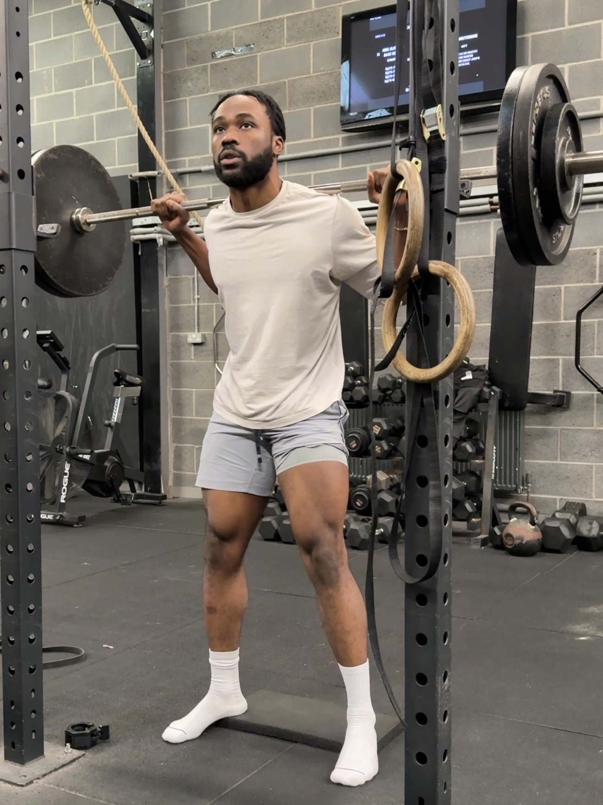
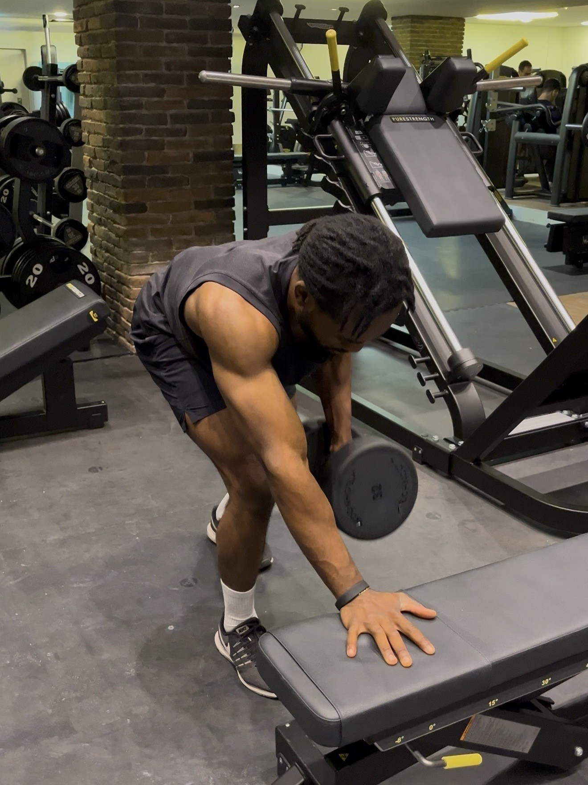
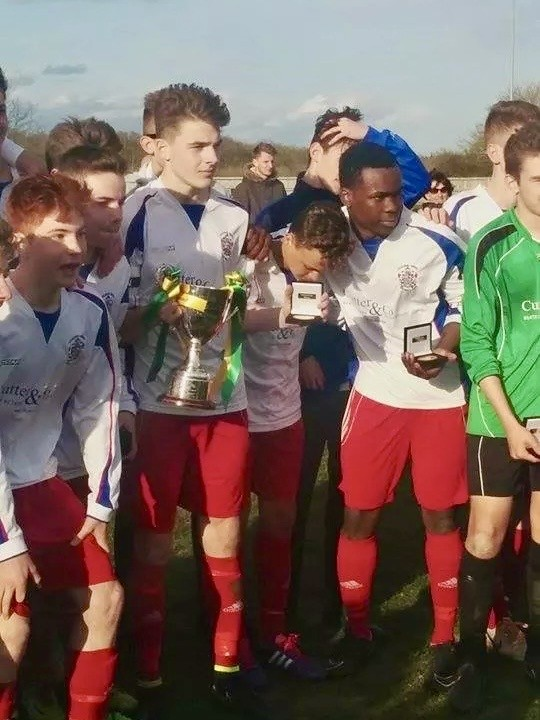

# Sports-and-Fitness
 A record of long-term athletic development, encompassing competitive football (EJA League winner), multi-disciplinary fitness, and consistent endurance training.
 
## 🏋️‍♂️ Physical Discipline & Multi-Disciplinary Fitness
Over the last 5 years, I have engineered a consistent, 4-day-per-week training split focusing on: 
* **Strength & Calisthenics:** Progressive overload in compound lifting and bodyweight mastery.

  

  
   
  <i>Strength training</i>

* **Endurance:** consistent distance running with a focus on performance milestones and aerobic base building.

## ⚽ Competitive Athletics (2012 – 2017) 

* **Team:** Hadleigh United FC (Local Town).
* **Achievement:** Eastern Junior Alliance (EJA) League Champions (2015) – U16.
* **Key Skills:** High-pressure teamwork, tactical discipline, and commitment to a 5-year competitive development cycle.
  

  
   
  <i>Winners EJA(U16) 2015</i>

